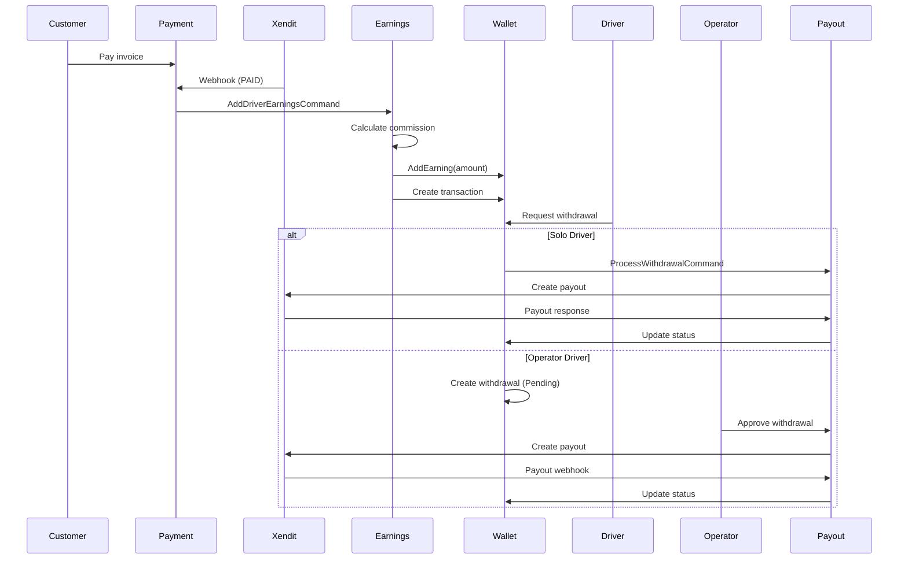

# Driver Earnings and Payout System Implementation

## Overview

This plan implements the complete driver earnings and payout flow:

1. **Automatic earnings addition** when payments are completed (with commission calculation)
2. **Operator-managed payouts** for drivers under operators
3. **Direct payouts** for solo drivers
4. **Xendit payout/disbursement integration**

## Architecture

### Driver Types

- **Solo drivers** (`IsSoloDriver = true`): Direct payout flow
- **Operator drivers** (`IsSoloDriver = false`, `CompanyId` set): Operator-managed payout flow

### Earnings Flow

```
Payment Paid (via webhook)
  ↓
Calculate driver earnings (payment amount - commission)
  ↓
Add to driver wallet balance
  ↓
Create wallet transaction record
```

### Payout Flow

**Solo Drivers:**

```
Driver clicks "Withdraw"
  ↓
Create withdrawal request
  ↓
Call Xendit payout API
  ↓
Update database based on Xendit response
```

**Operator Drivers:**

```
Driver clicks "Withdraw"
  ↓
Create withdrawal request (status: Pending)
  ↓
Operator approves withdrawal
  ↓
Call Xendit payout API
  ↓
Update database based on Xendit response
```

## Implementation Details

### 1. Commission Configuration

**File**: `bee-backend/src/Modules/BeeLogistics.Modules.Drivers/Domain/DriverWallet.cs`

Add commission calculation logic:

- Solo drivers: 0% commission (100% earnings)
- Operator drivers: Configurable commission percentage (stored per operator/company)

**New Entity**: `CommissionRate` (optional - can be stored in Company or as configuration)

- `CompanyId` (nullable - null for solo drivers)
- `CommissionPercentage` (decimal, 0-100)

### 2. Automatic Earnings Addition

**File**: `bee-backend/src/Modules/BeeLogistics.Modules.Payment/Application/Handlers/PaymentHandlers.cs`

Modify `ProcessWebhookHandler`:

- When payment is marked as `Paid`, trigger earnings calculation
- Use MediatR to send `AddDriverEarningsCommand` to Drivers module
- Calculate earnings: `payment.Amount * (1 - commissionRate)`

**New Command**: `AddDriverEarningsCommand`

- `DispatchId` (to find driver)
- `BookingId` (to find payment)
- `Amount` (calculated earnings)
- `PaymentId` (reference)

**New Handler**: `AddDriverEarningsCommandHandler`

- Get dispatch to find driver
- Get or create driver wallet
- Calculate commission (0% for solo, configurable for operator drivers)
- Add earnings to wallet: `wallet.AddEarning(earningsAmount)`
- Create wallet transaction: `WalletTransactionType.Earning`
- Link transaction to dispatch and payment

### 3. Xendit Payout Integration

**File**: `bee-backend/src/Modules/BeeLogistics.Modules.Payment/Application/Interfaces/IXenditService.cs`

Add payout methods:

- `CreatePayoutAsync(CreatePayoutRequest request)`
- `GetPayoutAsync(string payoutId)`

**File**: `bee-backend/src/Modules/BeeLogistics.Modules.Payment/Infrastructure/Services/XenditService.cs`

Implement Xendit disbursement API:

- Use Xendit Disbursements API (`/disbursements`)
- Support bank account payouts
- Handle payout status webhooks

**New Records**:

- `CreatePayoutRequest` (amount, bank account, account holder name, etc.)
- `XenditPayoutResponse` (payout ID, status, etc.)

### 4. Payout Processing

**File**: `bee-backend/src/Modules/BeeLogistics.Modules.Drivers/Application/Handlers/DriverHandlers.cs`

**Modify `RequestWithdrawalCommandHandler`**:

- For solo drivers: Immediately process payout via Xendit
- For operator drivers: Create withdrawal request with `Pending` status (wait for operator approval)

**New Command**: `ProcessWithdrawalCommand` (for operators to process driver withdrawals)

- `WithdrawalRequestId`
- `ProcessedByUserId` (operator user ID)

**New Handler**: `ProcessWithdrawalCommandHandler`

- Get withdrawal request
- Verify operator has permission (check if driver belongs to operator's company)
- Call Xendit payout API
- Update withdrawal request status based on Xendit response
- Update wallet: `wallet.CompleteWithdrawal(amount)`
- Create wallet transaction: `WalletTransactionType.Payout`

### 5. Xendit Payout Webhook

**File**: `bee-backend/src/Modules/BeeLogistics.Modules.Payment/Presentation/Controllers/WebhooksController.cs`

Add payout webhook handler:

- Handle Xendit payout status updates
- Update withdrawal request status
- Update wallet transaction status

### 6. Operator Payout Management

**New Controller**: `bee-backend/src/Modules/BeeLogistics.Modules.Drivers/Presentation/Controllers/OperatorPayoutController.cs`

Endpoints:

- `GET /api/operators/{operatorId}/drivers/withdrawals` - List pending withdrawals for operator's drivers
- `POST /api/operators/{operatorId}/withdrawals/{withdrawalId}/approve` - Approve and process withdrawal
- `POST /api/operators/{operatorId}/withdrawals/{withdrawalId}/reject` - Reject withdrawal

### 7. Commission Configuration

**New Entity**: `OperatorCommission` (optional - can use Company entity)

- Store commission percentage per operator/company
- Default: 0% for solo drivers, configurable for operators

**New Endpoint**: `PUT /api/operators/{operatorId}/commission` - Update commission rate

## Files to Create/Modify

### New Files

1. `bee-backend/src/Modules/BeeLogistics.Modules.Drivers/Application/Commands/AddDriverEarningsCommand.cs`
2. `bee-backend/src/Modules/BeeLogistics.Modules.Drivers/Application/Commands/ProcessWithdrawalCommand.cs`
3. `bee-backend/src/Modules/BeeLogistics.Modules.Drivers/Presentation/Controllers/OperatorPayoutController.cs`
4. `bee-backend/src/Modules/BeeLogistics.Modules.Payment/Application/Interfaces/IPayoutService.cs` (optional - can extend IXenditService)

### Modified Files

1. `bee-backend/src/Modules/BeeLogistics.Modules.Payment/Application/Handlers/PaymentHandlers.cs` - Add earnings trigger
2. `bee-backend/src/Modules/BeeLogistics.Modules.Payment/Application/Interfaces/IXenditService.cs` - Add payout methods
3. `bee-backend/src/Modules/BeeLogistics.Modules.Payment/Infrastructure/Services/XenditService.cs` - Implement payout API
4. `bee-backend/src/Modules/BeeLogistics.Modules.Payment/Presentation/Controllers/WebhooksController.cs` - Add payout webhook
5. `bee-backend/src/Modules/BeeLogistics.Modules.Drivers/Application/Handlers/DriverHandlers.cs` - Modify withdrawal handler, add earnings handler
6. `bee-backend/src/Modules/BeeLogistics.Modules.Drivers/Domain/DriverWallet.cs` - Add commission calculation helper (optional)

## Data Flow Diagram



## Configuration

### AppSettings

```json
{
  "Xendit": {
    "ApiKey": "...",
    "BaseUrl": "https://api.xendit.co/",
    "WebhookToken": "...",
    "DisbursementsEnabled": true
  },
  "DriverEarnings": {
    "DefaultCommissionRate": 0.10,  // 10% default for operators
    "SoloDriverCommissionRate": 0.00  // 0% for solo drivers
  }
}
```

## Testing Considerations

1. Test earnings addition when payment is paid
2. Test commission calculation for solo vs operator drivers
3. Test solo driver direct payout flow
4. Test operator driver approval flow
5. Test Xendit payout API integration
6. Test payout webhook handling
7. Test error scenarios (insufficient balance, Xendit failures, etc.)

## Migration Notes

- No database migrations needed (existing wallet structure supports this)
- May need to backfill earnings for existing completed payments (optional)
- Commission rates can be added to Company entity or separate table

## Implementation Todos

1. **Commission Configuration** - Add commission configuration (solo drivers 0%, operator drivers configurable)
2. **Earnings Command** - Create AddDriverEarningsCommand and handler to add earnings when payment is paid
3. **Payment Webhook Earnings** - Modify ProcessWebhookHandler to trigger earnings addition when payment is marked as Paid
4. **Xendit Payout Service** - Extend XenditService to support payout/disbursement API methods
5. **Withdrawal Flow Solo** - Modify RequestWithdrawalCommandHandler to process solo driver payouts directly via Xendit
6. **Withdrawal Flow Operator** - Modify RequestWithdrawalCommandHandler to create pending withdrawals for operator drivers
7. **Operator Payout Controller** - Create OperatorPayoutController for operators to approve and process driver withdrawals
8. **Payout Webhook** - Add Xendit payout webhook handler to update withdrawal status
9. **Process Withdrawal Command** - Create ProcessWithdrawalCommand handler for operators to process approved withdrawals
