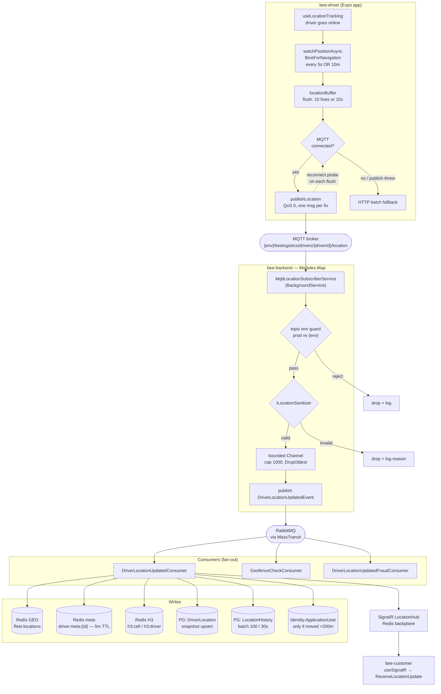

# Driver Location Flow

How a driver's GPS position travels from the phone to a customer's map, what it
writes along the way, and how long each cached artifact lives.

Spans `bee-driver` (Expo app) → external MQTT broker → `bee-backend`
(`Modules.Map`) → RabbitMQ/MassTransit → Redis + PostgreSQL → SignalR →
`bee-customer`.

---

## End-to-end diagram



### Stale-drop points

Location data is **lossy by design** at four places. Worth knowing when
debugging "the dot stopped moving":

| Stage | Behavior |
|---|---|
| MQTT publish | QoS 0 — no redelivery, no broker persistence |
| Ingest channel | Bounded at 1000, `DropOldest` under pressure |
| Consumer | Drops events older than **2 minutes** as stale |
| Consumer errors | Caught and logged, never rethrown — no MassTransit retry |

`DriverLocationUpdatedConsumer` deliberately swallows exceptions
("better to drop it than clog the queue"), so a Redis or DB blip silently loses
that fix rather than retrying. `LocationHistoryBatchWriter` likewise discards a
failed batch outright to avoid unbounded buffer growth.

---

## Cache TTLs

### Location caches (`Modules.Map`)

| Key | Written by | TTL | Notes |
|---|---|---|---|
| `driver:meta:{driverId}` | `RedisLocationCache` | **5 min** (`MetaTtl`, hardcoded) | speed, heading, lat/lng, `LastUpdate` |
| `fleet:locations` (GEO set) | `RedisLocationCache` | **none** | see caveat below |
| `h3:driver:{driverId}` | `H3DriverGeoIndex` | **staleness × 2** = 10 min | driver's current cell, for move cleanup |
| `h3:cell:{cellHex}` (sorted set) | `H3DriverGeoIndex` | **staleness × 4** = 20 min | refreshed on every write to the cell |

H3 tuning is config-driven with these defaults:

| Setting | Default | Meaning |
|---|---|---|
| `Map:H3:Resolution` | `8` | ~0.74 km² cells (~460 m edge) |
| `Map:H3:MaxRings` | `3` | ring expansion cap around origin cell |
| `Map:H3:StalenessMinutes` | `5` | drives both the query cutoff and the key TTLs |

Note the two TTLs are *deliberately* longer than the 5-minute staleness window:
`FindNearestDriversAsync` filters by score with a `now - staleness` cutoff, so
correctness comes from the score filter, and the longer key TTL exists only to
stop empty cells from accumulating.

> **Caveat — `fleet:locations` never expires.** `GeoAddAsync` sets no TTL and
> the only cleanup, `RedisLocationCache.RemoveDriverAsync`, has **no callers**
> in the codebase. The set therefore grows monotonically and retains every
> driver that has ever reported a position. This is currently latent rather
> than harmful: the only reader, `GetDriversWithinRadiusAsync`, is also
> uncalled — live matching goes through the H3 index, which *does* filter
> staleness. So today it's a slow memory leak, but any future code that reaches
> for `GetDriversWithinRadiusAsync` would silently match long-offline drivers.

### Other Redis caches (for context)

| Cache | TTL |
|---|---|
| `RedisCacheService.SetAsync` default | **10 min** (`AbsoluteExpirationRelativeToNow`) |
| Cache key prefix (`InstanceName`) | `BeeLogistics:` |
| SignalR backplane channel prefix | `BeeLogistics:signalr:` |
| OTP codes (`otp:*`) | **10 min** |
| Email/phone verified-for-registration | **20 min** / **30 min** |
| Token blacklist (`TokenBlacklistService`) | **60 min** (matches JWT expiry) |
| Rate limit counters | = the window (60s general, 300s auth, 900s OTP send, 3600s OTP-per-IP) |

All Map-module Redis writes are wrapped in try/catch and log-but-continue —
Redis being down degrades matching to a DB scan rather than failing the
location pipeline. The multiplexer also sets `AbortOnConnectFail = false`, and
`Program.cs` falls back to an in-memory cache if Redis can't be reached at
startup.

---

## How the estimate is calculated

Two different "estimates" exist in this system, and they are in very different
states.

### ETA (`EstimatedArrivalMinutes`) — **not implemented**

`DriverBookingOffer.EstimatedArrivalMinutes` is a nullable column that is only
ever assigned from its constructor parameter
(`DriverBookingOffer.cs:43`). The single production call site passes `null`:

```csharp
// BeeLogisticsBookingHandlers.cs:296
offer = new DriverBookingOffer(
    request.BookingId,
    request.DriverId,
    expirationTime,
    null, // Distance will be calculated
    booking.FavouriteDriverId == request.DriverId,
    null, // Rating will be fetched
    null  // Estimated arrival will be calculated
);
```

The matching handler carries an explicit `// TODO: Calculate estimated arrival
times` (`BeeLogisticsBookingHandlers.cs:240`). `DriverOfferHandlers.cs:147`
reads the field back and serves it to the driver app, so **the API always
returns `null` for ETA**. Same story for the adjacent `distanceKm` and
`driverRating` offer fields.

Everything needed to compute it already exists — `H3DriverGeoIndex` returns a
Haversine `distanceKm` per candidate, `PostGISDistanceService` does exact
`ST_Distance` over geography, and the Redis meta blob carries current `Speed`.
Nothing wires them together into an ETA.

### Fare (`EstimatedFare`) — implemented, but client-supplied at booking

`PricingService.CalculateFareAsync` is a real, config-driven calculation:

```
base fare (per vehicle type)
+ distance fare        → ≤5 km: km × PerKm0to5
                         >5 km: (5 × PerKm0to5) + ((km − 5) × PerKmAbove5)
+ multi-stop fee       → dropoffStops × AdditionalStopFee
+ weight surcharge     → (weightKg − WeightLimitKg) × WeightSurchargePerKg
+ priority fee
× high-demand multiplier (applied to base+distance+stops+weight)
```

Route distance comes from `IRouteDistanceCalculationService`; vehicle config
from `IPricingConfigurationService`, falling back to `CalculateDefaultFareAsync`
for unknown vehicle types.

However, `CreateBooking` persists `dto.EstimatedFare` straight from the request
(`BeeLogisticsBookingHandlers.cs:132`) rather than calling `PricingService`, and
that same value seeds the cash-on-delivery payment (line 160) and later becomes
`FinalFare` when no final fare is set (line 533). Pricing is exposed separately
via `PricingHandlers` / `BookingsController` for the client to quote against.

---

## Key files

| Concern | File |
|---|---|
| Tracking lifecycle | `bee-driver/features/driver/hooks/useLocationTracking.ts` |
| Buffer + flush + fallback | `bee-driver/features/driver/services/locationTrackingService.ts` |
| MQTT client / publish | `bee-driver/features/driver/services/mqttLocationService.ts` |
| Ingest, env guard, channel | `Modules.Map/Infrastructure/Services/MqttLocationSubscriberService.cs` |
| Main processing + broadcast | `Modules.Map/Application/Consumers/DriverLocationUpdatedConsumer.cs` |
| Redis GEO + meta cache | `Modules.Map/Infrastructure/Services/RedisLocationCache.cs` |
| H3 matching index | `Modules.Map/Infrastructure/Services/H3DriverGeoIndex.cs` |
| Distance (PostGIS + Haversine) | `Modules.Map/Infrastructure/Services/PostGISDistanceService.cs` |
| Hub / groups | `Modules.Map/Presentation/Hubs/LocationHub.cs` |
| Consumer registration | `Modules.Map/DependencyInjection.cs` (`AddLocationConsumers`) |
| Fare calculation | `Modules.Bookings/Application/Services/PricingService.cs` |
| Customer subscription | `bee-customer/shared/hooks/useSignalR.ts` |
