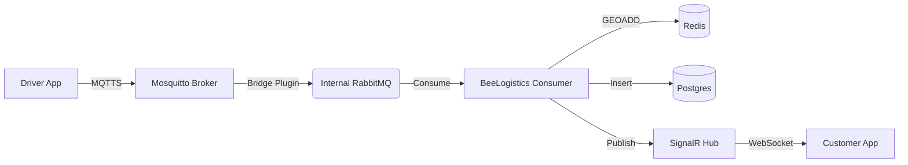

# Location Service Design & Best Practices

## 1. Why do we need coordinates?
Collecting driver coordinates is not just about "seeing a car on a map." It enables critical logistics features:
*   **Real-time ETA Updating**: Adjusting arrival times based on traffic and actual driver progress.
*   **Geofencing**: Automatically changing status to "Arrived at Pickup" or "Completed" when the driver enters a specific radius (e.g., 50m) of the destination.
*   **Smart Dispatching**: Assigning new orders to the *nearest* available driver rather than just a random one.
*   **Resolution & Trust**: In case of disputes (e.g., "Customer wasn't home"), you have a breadcrumb trail proving the driver's location.
*   **Route Optimization**: analyzing historical data to plan better routes in the future.

## 2. Risks of using MQTT
MQTT (Message Queuing Telemetry Transport) is the industry standard for IoT and location tracking, but it comes with challenges:

### A. Security Risks
*   **Unauthorized Subscription**: If topic ACLs (Access Control Lists) are not strict, a bad actor could subscribe to `drivers/+/location` and track your entire fleet.
    *   *Mitigation*: Strict per-user topic permissions (e.g., Driver A can only publish to `drivers/A/loc`).
*   **Exposing Internal Broker**: Exposing your main internal RabbitMQ/message broker directly to the public internet for mobile devices is risky.
    *   *Mitigation*: Use a dedicated "Edge" MQTT broker (like EMQX or HiveMQ) that forwards processed data to your internal backend.

### B. Mobile Reliability
*   **Connection Flakiness**: Mobile networks (4G/5G) drop frequently.
*   **Battery Drain**: A poorly configured MQTT client that sends 'KeepAlives' too frequently prevents the phone from sleeping.
*   **Background Process Killing**: iOS and Android aggressively kill background apps. Standard MQTT connections might be severed by the OS.
    *   *Mitigation*: Use platform-specific background location services that "wake up" the app to send batches of data.

---

## 3. Industry Standards (What Grab, Lalamove, Uber use)
Big logistics players typically use a specific architecture pipeline:

1.  **Ingestion (The "Firehose")**: A highly available gateway accepts millions of points per second.
    *   *Protocol*: MQTT (over TLS) or gRPC.
    *   *Tech*: Uber uses **gRPC** for driver streams. Others use MQTT (like HiveMQ or Mosquitto).
2.  **Processing (The "Filter")**:
    *   "Map Matching" (snapping noisy GPS points to valid roads).
    *   Kalman Filters (smoothing out erratic movements).
3.  **Storage**:
    *   **Hot Storage (Last known location)**: Redis (using `GEOADD`). This enables "Find 5 drivers near me" in milliseconds.
    *   **Cold Storage (History)**: Cassandra, ScyllaDB, or TimescaleDB (Postgres extension) for audit logs.

---

## 4. Implementation Options for BeeLogistics

Given your existing stack (**MassTransit/RabbitMQ**, **SignalR**, **.NET 8**), here are your best paths:

### Option A: The "SignalR + Redis" Approach (Fastest to MVP)
Since strictly "Real-time" (sub-second) isn't always needed for logistics (unlike ride-hailing), this is a solid start.

*   **Driver App**:
    *   Collects points every 3-5 seconds.
    *   Batches them and sends via **HTTP POST /api/location** every 15-30 seconds (or immediately on significant movement).
*   **Backend (API)**:
    *   Receives batch.
    *   Saves "Current Location" to **Redis** (`GEOADD drivers <lat> <lon> <driverId>`).
    *   Publishes "DriverMoved" event via **SignalR** to the specific customer observing that driver.
    *   Asynchronously saves history to database (Postgres).
*   **Pros**: No new infrastructure (MQTT broker) needed. Easy to secure.
*   **Cons**: Higher latency (10-15s delay). Higher battery usage if using HTTP too often.

### Option B: The "Hybrid RabbitMQ" Approach (Better for scaling)
RabbitMQ has a **WebMQTT** plugin.
*   **Driver App**: Connects via MQTT (WebSockets) to RabbitMQ. Publishes to `loc/{driverId}`.
*   **Backend**: MassTransit consumer listens to `loc/#`.
*   **Pros**: Lower bandwidth than HTTP. Real-time.
*   **Cons**: Exposes RabbitMQ to the public internet (requires very careful config).

### Option C: The "Secure Bridge" Approach (Your Setup)
Since you already have **Mosquitto** and an internal **RabbitMQ**:
*   **Driver App**: Connects to **Mosquitto** (Publicly exposed). Publishes to `drivers/{driverId}/loc`.
*   **Mosquitto**: Configured to **Bridge** messages to your internal **RabbitMQ**.
    *   *Why?* Mosquitto handles the messy, unstable mobile connections. RabbitMQ stays safe and stable internally.
*   **Backend**: MassTransit consumer listens to the queue in RabbitMQ.
*   **Pros**: 
    *   **Security**: Your core message bus (RMQ) is NOT exposed to the internet. Mosquitto acts as the DMZ.
    *   **Reliability**: Mosquitto is lightweight and great for handling 10k+ flaky mobile connections.
    *   **Clean**: The backend API doesn't even know where the location came from.

## 5. Recommended Architecture for BeeLogistics

**Recommendation**: Use **Option C (The Secure Bridge)**. 

Since you have the infrastructure ready, this is the "Gold Standard" for logistics apps. It gives you the high-performance ingestion of MQTT without compromising the security of your internal backend bus.

1.  **Mobile App**: Connects to `mqtt.yourdomain.com` (Mosquitto) via MQTTS (Secure).
2.  **Ingestion**: Mosquitto accepts the message and bridges it to RabbitMQ topic `driver.location`.
3.  **Processing (Backend)**:
    *   **MassTransit Consumer** reads from `driver.location`.
    *   Updates **Redis** (`GEOADD` for live map queries).
    *   Publishes `DriverMoving` event.
4.  **Distribution**:
    *   **SignalR Consumer**: Pushes update to observing Customers.
    *   **Audit Consumer**: Writes to Postgres/TimescaleDB.



### Next Steps
1.  **Define the Location schema**:
    ```json
    {
      "driverId": "guid",
      "lat": 14.5995,
      "lng": 120.9842,
      "accuracy": 10.5,
      "heading": 45.0,
      "speed": 30.5,
      "timestamp": "2023-10-27T10:00:00Z"
    }
    ```
2.  **Add `Redis` Geo support** to the `Modules.Map`.
3.  **Create a Background Job** in the app to process buffered location updates if high volume.
4.  **Security**: Ensure the API endpoint checks `CurrentUserId == driverId`.
